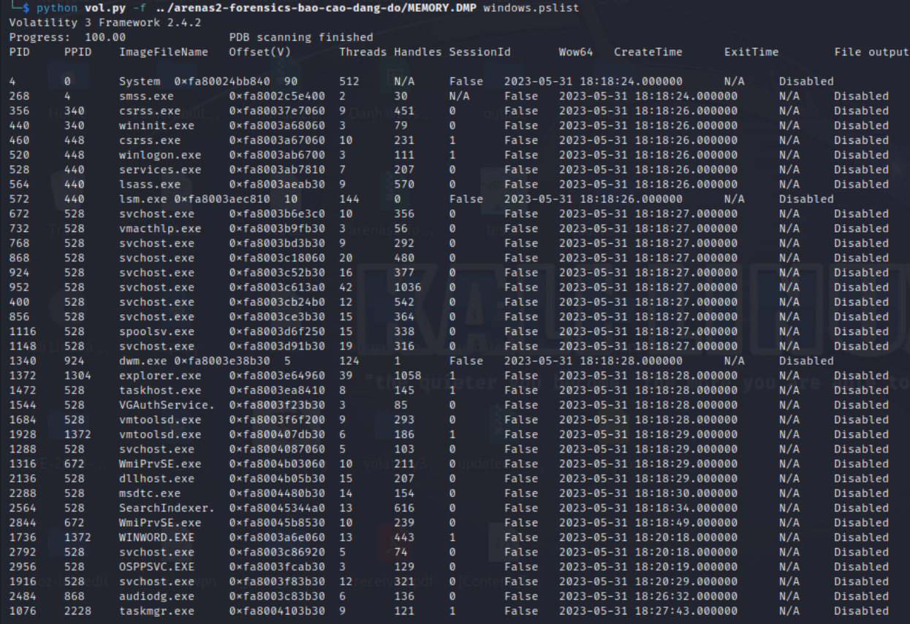
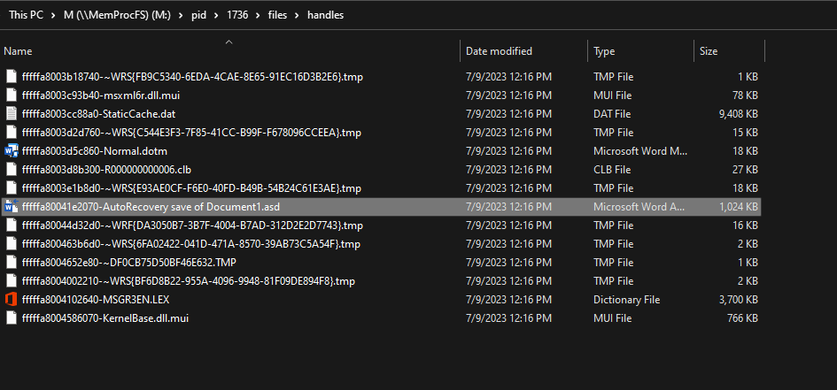
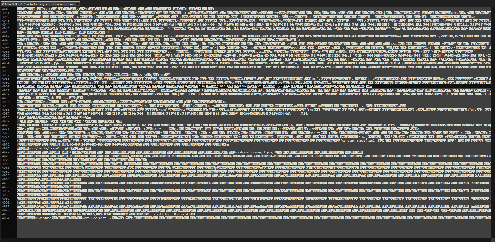
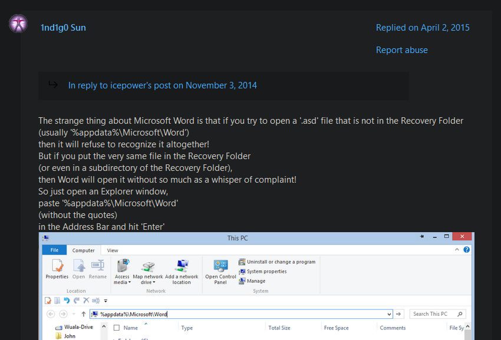
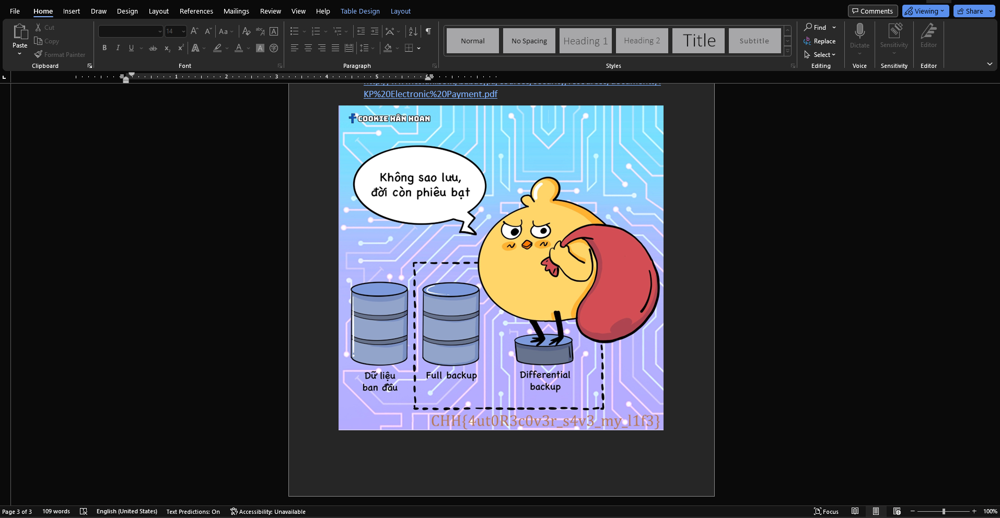

## Báo cáo dang dở
### Difficulty: Medium
> Hòa đang làm báo cáo bài tập lớn để nộp cho thầy giáo thì bỗng nhiên máy tính của anh ấy bị tắt đột ngột do mất điện mà anh ấy thì chưa kịp lưu báo cáo một lần nào. Tuy nhiên sau đó, thay vì viết báo cáo mới thì Hòa đã chọn cách dành ra 4h đồng hồ để khôi phục báo cáo ban đầu từ tệp crash dump nhưng cuối cùng vẫn thất bại. Hòa thực sự đang cần trợ giúp.
### Tools used
- `volatility`
- `MemProcFS`
### Resources
Too heavy to upload here, so please ask me for the file!
### Solution
In this challenge, we are given a `.dmp` file. This is a Windows memory dump file, and we can use `Volatility` to analyze it. First, we list all running processes using the `windows.pslist` plugin.

We can see that there is Microsoft Word running on this machine (`WINWORD.EXE` with PID 1736). Normally, when Microsoft Word shuts down unexpectedly when editing a file, it will create an AutoRecovery file with `.asd` extension to save the progress. So, I decided to look for the AutoRecovery file of the file that Hòa was working on before the crash.
However, my virtual machine does not have Microsoft Office installed, so I switched to my Windows machine. I used a tool called `MemProcFS` that can be used to mount the dump file as a virtual file system. After mounting the dump file, I went searching for the Word file that was opened before the crash. Going to find all the files created by the process with PID 1736, I found the AutoRecovery file of a Word file named `Document1`. Maybe this is the file that Hòa was working on before the crash.

At first, I tried to open the file using Microsoft Word, but there was an error that required me to move the AutoRecovery file to the same directory as the original file, which is impossible in this case. 

So, I decided to directly open the file using notepad. But it only showed some gibberish text.

The text that was readable indicated that this file contains some png file. So, I had an idea to extract the png file, but this can only be done if we know the exact location of the png data inside the file, which I did not know at what position it was because of the gibberish text.
Stuck at this point, I decided to search Google for a solution. Looking for the way to open an AutoRecovery file without moving it to the original file's directory, I found a [post](https://answers.microsoft.com/en-us/windows/forum/all/converting-asd-back-to-word-possible-help/4cef1089-bed6-4f24-b911-c6d023f08c80) on Microsoft Support forum that was similar to my problem. And finally, I found the solution to my problem. 

Doing as the instruction, I was able to open the AutoRecovery file using Microsoft Word. And the flag is hidden in the file, inside the image.

The flag is `CHH{4ut0r3c0v3r_s4v3_my_l1f3}`.