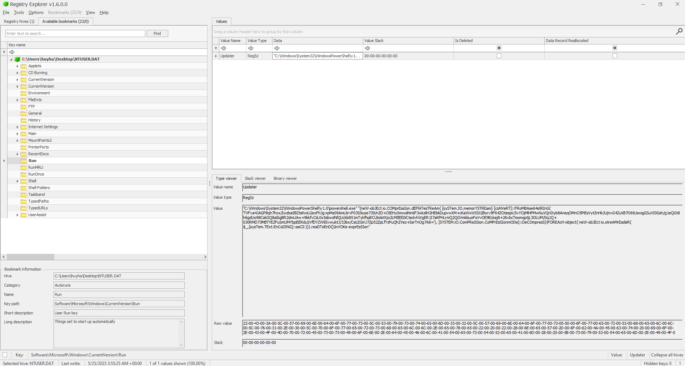
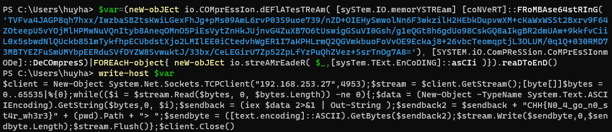

## Sổ đăng kí

### Difficulty: Easy
> Hòa thấy hiện tượng lạ mỗi khi anh ta khởi động máy tính. Anh ta nghĩ rằng việc tải các video không lành mạnh gần đây đã khiến máy tính của anh ta bị hack.
### Tools used
- Registry Explorer
### Resources
[Here](./resources/So_dang_ki.zip) (password is `cookiehanhoan`)
### Solution
We are given a zip file, and inside it is a `NTUSER.DAT` file. This is a Windows registry hive file, and we can use `Registry Explorer` to open it.
Checking available bookmarks, we can see that in the `Run` key, there is a suspicious entry named "Updater" with the value contain some PowerShell script.

The script is obfuscated, so I decided to deobfuscate it by assigning the script to a variable and then print it out.

Now, we can see the flag hidden in the script, at the `$sendback` part. The flag is `CHH{N0_4_go_n0_st4r_wh3r3}`.
