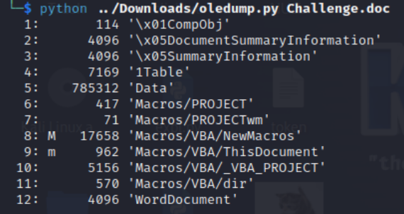

## Tin học văn phòng cơ bản
### Difficulty: Easy
> Sau khi tham gia một khóa Tin học văn phòng cơ bản, Hòa đã có thể tự tạo một tệp tài liệu độc hại và anh ta có ý định sẽ dùng nó để hack cả thế giới.
### Tools used
- `oledump`
### Resources
[here](./resources/arenas2-forensics-tin-hoc-van-phong-co-ban.zip)(password is `cookiehanhoan`)
### Solution
In this challenge, we are given a `.doc` file. Right after opening it, the Windows Defender detected it as a malicious file. This means that there are something malicious hidden inside the file.
Using `oledump` to analyze the file, we can see that there is a VBA macro inside it (the macro is marked as `M`).

We can extract and restore the VBA macro source code using `oledump` as well.

Reading the source code, we found the flag hidden in the `MsgBox` function. 

The flag is `CHH{If_u_w4nt_1_will_aft3rnull_u}`.
