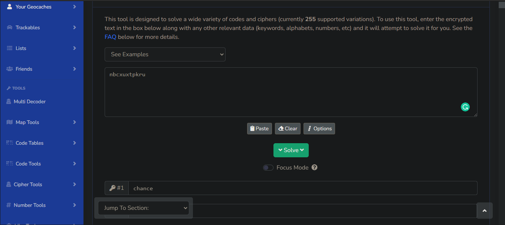

# Wonka-Bar
## Tools used to solve this challenge
- `pdf2john`
- [cachesleuth](https://www.cachesleuth.com/multidecoder/)
- [Blender](https://www.blender.org/)
- [exiftool](https://exiftool.org/)
- [dcode.fr](https://www.dcode.fr/)
## Solution

The downloaded PDF file can’t be opened without a password. Normally, a PDF file always stored a hash of the password inside it, so we can extract the hash and try to bruteforcing it.
Using `pdf2john`, we get the hash of the password: `$pdf$2*3*128*-4*1*16*398136e5609d93bb2ed6a941e13d1505*32*28bf4bcec371cfb7bbd7c25b9c45af2828bf4e5e4e758a4164004e56fffa0108*32*7f444aa3498f9f55c4b118120c8a2e3ae7b4666b6a90514b09285bfaee7a8703`. Bruteforcing this by using GPU, my friend (**@sonarypt**, thank you so much!) found the password for the PDF file: `13euro`.
Open this file, we can see a link that lets us download a zip file named `wonkabar-golden-ticket.zip`. This file can’t be opened without a password, which was provided by the following 2 lines of text in the pdf file:

The word “chance” is bolded, so this may be key to deciphering the text. Try to decode the cipher using [cachesleuth](https://www.cachesleuth.com/multidecoder/), I found the word that seems to be the password of the RAR file:`luckstrikes`

This word is exactly the password of the zip file. After extracting it, we get 4 files:

Using the Hex editor to look at the binary, we can see that this file is created by [Blender](https://www.blender.org/), a 3D software used for creating 3D models:

At first, I tried to use the “3D Builder” app made by Microsoft, but when I imported the obj file, an error appeared: 

So, I downloaded the Blender software, and while playing with the app a little bit, I found that inside the chocolate bar has some text! After Googling for 10 minutes to see “how to make an object transparent”, by toggling the X-Ray mode, I found an URL inside the bar:

After going to the link, we can download an image named `wonkafactory.jpg`. Checking the metadata of the file using `exiftool`, we found the comment which seem to be the flag, but decoded again:

Solve the function, we get 2 values of x: 5 and 13. The comment required us to use a smaller value of x, so the cipher we are dealing with is the __Ceasar Cipher with the shift value of 5.__

With the decrypt option is “Decrypt using the alphabet and the digits”, we get the first decoded text: `flag ? niteCTF"3arthysa~syh3ll0$`. It has the form of a real flag, but the string after `niteCTF` seems not to be the real flag. So, we need to find another way to decode this.
That’s when I remembered the ASCII table. 

Using the option that uses the ASCII table, we finally get the “real” flag: `flag←:←niteCTF↔3arth_says_h3ll0▼`. 

So, the flag of this challenge is `niteCTF{3arth_says_h3ll0}`